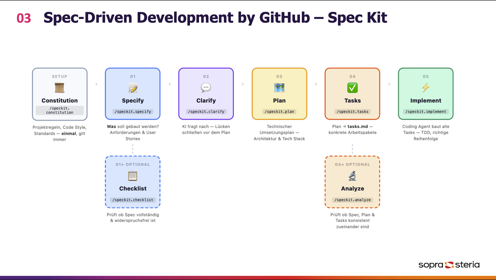
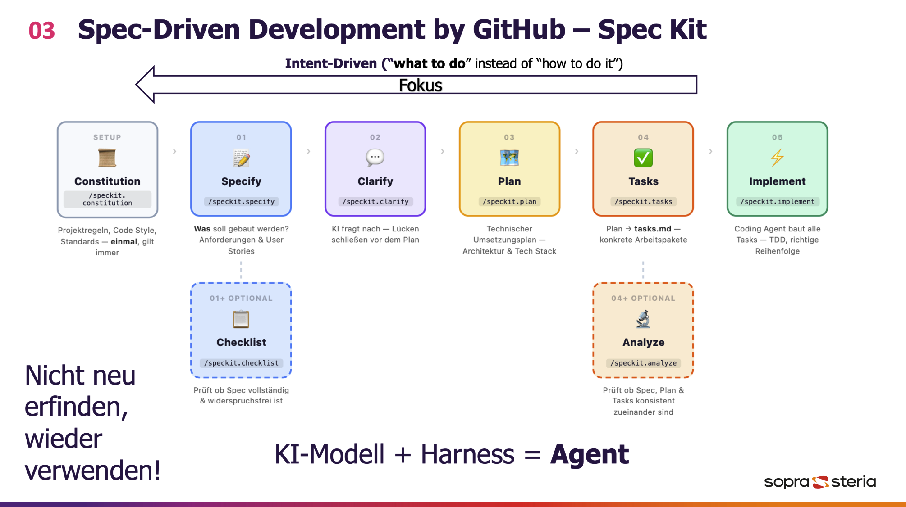

# Tagesablauf – Spec2Code Coding Dojo

---

## Slot 1 – Setup & Support Session

**Kontext:** Ursprünglich war das Dojo mit **GitHub Codespaces** geplant – das funktioniert leider nicht. Wir arbeiten daher mit einem **lokalen VS Code Setup**.

**Inhalt:**
- Kurze Erklärung: Was war geplant, was hat nicht funktioniert, warum VS Code lokal
- Support Session: Alle richten ihre lokale Umgebung ein
- Wer fertig ist, hilft den Nachbarn

**Wichtig: Es gibt eine Langbeschreibung!!!**
- [Longtro](02_Longtro.md).

---

## Slot 2 – Intro: Was machen wir heute?

**Ziel - 01:** Eine Idee vermitteln – kein konkretes Vorgehen.

**Ziel - 01:** KI Ping Pong

### Intent Driven - by GitHub SpecKit

- Kurzer Blick ins **SpecKit** (SpecKit)
- **Intent Driven Development** – was bedeutet das, warum ist das relevant?
  

  

- [SpecKit Skills](_output/skills/speckit-commands)

### KI Ping Pong

- Was ist KI PingPong — ein iterativer Arbeitsmodus, bei dem Mensch und KI sich gegenseitig Impulse zuspielen, bis ein Ergebnis entsteht. → [KI PingPong](assets/00_KI_PingPong.md)

---

## Slot 3 – Ablauf des Workshops

---

### Task 1 – High Level & Detail Requirements (KI Pingpong)

**Ziel:** Mit KI Pingpong die zwei Skills schreiben — einen für High Level Requirements, einen für Detail Requirements.

In Teams: mit KI Pingpong gemeinsam herausarbeiten, was die Software tut.

0. **Git Projekt auschecken** – Keine Ahnung wie das geht? Macht nichts — fragt einfach die KI:
   > *„Check mir dieses Git Projekt in diesem Space aus: https://github.com/snellefiets/S2CW.git"*

1. **High Level Requirements** – Was steckt in der Ausschreibung? Erst via KiPingPong klären, dann einen Skill daraus schreiben lassen. Alles in ein File.
2. **Detail Requirements** – Mit einem zweiten Skill eine Ebene tiefer gehen und die Details abfragen. Ein File pro HighLevel. 
ProTipp: Subagents :D.
3. **Gemeinsames Debriefing** – Zurückkommen und besprechen, wie's funktioniert hat, bevor es in Task 2 weitergeht.

---

### Task 2 – Module & Architektur

**Ziel:** Die SpecKit Skills als Referenz nehmen und mit KI Pingpong einen eigenen, abgespeckten Skill für den konkreten Use Case definieren — nach deren Vorbild, aber im Kleinen.

> **Wichtig:** Findet jetzt feste gemischte Teams aus je einer Business- und einer Technik-Person. Diese Teams bleiben zusammen — durch alle Debriefings — und vergleichen immer ihre eigenen Ergebnisse miteinander.

#### 🧑‍💼 Business-Zweig

**Ziel:** In den Product Owner Flow reinkommen — mit KI Pingpong durch Specify, Clarify und Modulbausteine arbeiten und spüren: Führt das zu Tickets? Wie fühlt sich das als PO an?

1. **Skills anpassen** – Nehmt die Skills aus Task 1 als Vorlage und passt sie auf eure eigenen High-Level Requirements an. Ein Skill pro Detailebene.
2. **Specify** – Alle Detail Requirements durchspezifizieren. Ein neues File pro Detail Requirement.
3. **Clarify** – Alle Files zusammen clarify-en.
4. **Module überlegen** – Aus Business-Sicht: In welche fachlichen Bausteine lässt sich das Ganze aufteilen?

#### 🛠️ Technik-Zweig

**Ziel:** Mit KI Pingpong herausfinden, wie sich Technik und Architektur sauber dokumentieren lassen — und was die KI braucht, um damit gut arbeiten zu können.

> 💡 **Kernidee:** Schaut euch den Clarify-Skill an — nicht um ihn zu kopieren, sondern um die **Idee dahinter** zu verstehen und für Architektur zweckzuentfremden. Mehr dazu im [Longtro](02_Longtro.md).

1. **Technische Anforderungen** – Im KI Pingpong herausarbeiten: Was brauchen wir technisch, um die Requirements umzusetzen?
2. **Grobe Architektur** – Wie könnte eine Architektur aussehen? Bewusst grob halten.
3. **Darstellungsform finden** – Welches Format liest die KI am besten? Architekturdiagramm, Textbeschreibung, strukturiertes Markdown? Ausprobieren.
4. **Bausteine identifizieren** – Welche technischen Komponenten gibt es?

#### 🔁 Gemeinsames Debriefing

- Zurückkommen und gemeinsam **MVP definieren in Mixed Team** — was bauen wir wirklich?

---

### Task 3 – Scoping via CLAUDE.md / Copilot Instructions

**Ziel:** Den MVP-Scope festschreiben — so dass die KI ihn ab jetzt immer kennt, egal was man fragt.

**Der Trick:** `CLAUDE.md` und `.github/copilot-instructions.md` werden von der KI bei jedem Prompt automatisch mitgelesen. Was dort steht, gilt immer — ohne dass man es jedes Mal neu sagen muss.

#### 🧑‍💼 Business-Zweig

1. **MVP markieren** – In den bestehenden High Level / Detail Requirements kennzeichnen: was ist MVP, was ist out of scope?
2. **Scope definieren** – z. B. "MVP = nur Kundenstrecke, kein Login". Was genau gehört dazu, was explizit nicht?
3. **CLAUDE.md / Copilot Instructions schreiben** – Den Scope als feste Anweisung reinschreiben: *"Arbeite immer nur im MVP-Scope. MVP bedeutet: nur Kundenstrecke."* Die KI hält sich ab jetzt daran.

#### 🛠️ Technik-Zweig

1. **Technischen MVP-Scope ableiten** – Welche Bausteine und Architekturteile sind für das MVP relevant, welche fallen raus?
2. **CLAUDE.md / Copilot Instructions schreiben** – Technische Constraints und Scope als feste Anweisung hinterlegen.
3. **Verifizieren** – Testet, ob die KI den Scope hält: stellt Fragen außerhalb des MVPs und schaut, ob sie ablehnt oder einschränkt.

#### 🔁 Roadmap (Business & Technik parallel)

Scope ist jetzt gesetzt — jetzt nutzt das. Mit KI Pingpong alle MVP-Specs in eine sinnvolle Reihenfolge bringen.

- **Business:** In welcher Reihenfolge sollte man die Features abarbeiten / priorisieren?
- **Technik:** In welcher Reihenfolge lassen sich die Bausteine implementieren?

Jede Seite erstellt ihre eigene Roadmap — auf Basis der gleichen MVP-Specs, aber aus der jeweiligen Perspektive.

#### 🔁 Gemeinsames Debriefing

Zusammenkommen und die zwei Roadmaps abgleichen: Was passt zusammen, wo gibt's Konflikte? Ziel ist eine gemeinsame, abgestimmte Roadmap.

---

